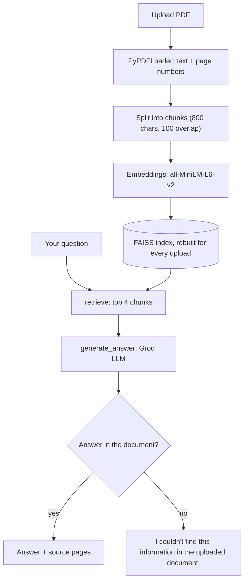

# 📄 DocChat AI

### Your PDF, answered. With page numbers.

An AI assistant that reads **your own PDF**, finds the right passages, and answers **only from the document**, with the source pages shown under every answer.

## 🚀 Live demo

**👉 [docchatassistant.streamlit.app](https://docchatassistant.streamlit.app/)**

**Hiring manager? Test it in 60 seconds:**

1. Upload any text-based PDF (handbook, report, paper, manual...)
2. Click a starter question, or ask your own
3. Check the **Sources** badge under the answer and compare it with the page in your PDF

> It's a free-tier demo, so it has limits: one PDF at a time (up to 50 pages / 10 MB) and 50 questions per day shared by all visitors. The first request may be slow after the app has been idle.

<!-- Add a screenshot or GIF here:  -->

## ✨ Features

- **Chat with your own PDF:** upload a document and ask questions in plain language. It works with any text-based PDF, not just one topic.
- **Page-referenced answers:** every answer shows its sources, for example `handbook.pdf — pages 12, 15`, so you can verify it.
- **No made-up answers:** the model is told to use only the retrieved document text. If the answer isn't there, it says: *"I couldn't find this information in the uploaded document."*
- **Fresh index per upload:** a new FAISS index is built for each file, so a new document never uses an old document's data.
- **Friendly errors:** clear messages (no tracebacks) for wrong file types, corrupted PDFs, scanned PDFs with no text, files that are too large, and API or rate-limit problems.
- **Built-in cost control:** page, size, question and answer limits plus a daily cap (see below).

## 🧠 How it works

- **LangGraph workflow:** a simple graph, `START → retrieve → generate_answer → END`, with a shared `TypedDict` state (question, context, sources, answer).
- **One graph per document:** `build_graph(vectorstore)` creates a graph that can only search the current document's index.
- **Page tracking:** every chunk keeps its file name and page number, which is how the sources are built.
- **Streamlit reruns:** the graph is kept in `st.session_state`, and the index is only rebuilt when the uploaded file changes. The embedding model is loaded once at startup.

## 🛡️ Token and quota protection

Built so a public demo can't burn through free-tier API limits:

| Level | Limit |
|---|---|
| Per document | 1 PDF, up to 50 pages and 10 MB |
| Per question | Up to 300 characters, top 4 chunks sent to the LLM |
| Per answer | 600-token cap, low reasoning effort, answers kept under about 200 words |
| Whole demo (all visitors) | 50 questions per day, counted in a thread-safe shared counter |
| Safe failures | Missing API key, bad files and API errors show friendly messages instead of crashing |

When the daily limit is reached, the chat box is disabled with a message. All limits are constants at the top of `streamlit_app.py` and `chatbot.py`.

## 🛠️ Tech stack

- **[LangGraph](https://github.com/langchain-ai/langgraph):** RAG workflow
- **[LangChain](https://www.langchain.com/):** PDF loading, text splitting, retriever
- **[Groq](https://groq.com/):** LLM inference (`openai/gpt-oss-120b`)
- **[FAISS](https://github.com/facebookresearch/faiss):** vector search
- **[Hugging Face](https://huggingface.co/):** embeddings (`sentence-transformers/all-MiniLM-L6-v2`)
- **PyPDF:** PDF text extraction
- **[Streamlit](https://streamlit.io/):** UI and hosting

## ⚠️ Known limitations

- The daily counter is saved in a local file, so it can reset when the app restarts or redeploys. For a hard cap, store it in an external database.
- There is no per-visitor limit, so one visitor can use the whole daily quota.
- Scanned PDFs (images only) are not supported, since there is no OCR.
- Each question is answered on its own, so follow-ups like "explain that more" don't use earlier chat history.
- Sources list every page that was retrieved, which may include pages the answer didn't actually need.
- Broad questions like "summarize everything" only see the top matching chunks, not the full document.
